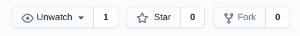
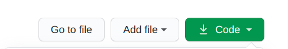
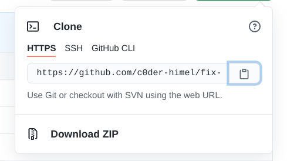
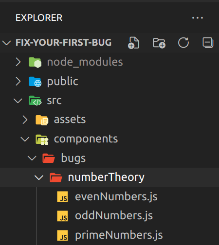
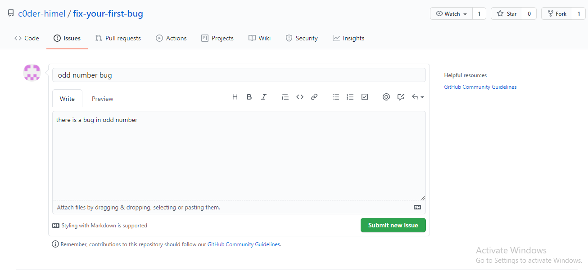

# Your First Contribution

This project aims to simplify and guide the way beginners make their first contribution. If you are looking to make your first contribution, follow the steps below.

## Fork this repository



Fork this repository by clicking on the fork button on the top of this page.
This will create a copy of this repository in your account.

## Clone the repository



Now clone the forked repository to your machine. Go to your GitHub account, open the forked repository, click on the code button and then click the _copy to clipboard_ icon.

Open a terminal and run the following git command:

```
git clone "url you just copied"
```

where "url you just copied" (without the quotation marks) is the url to this repository (your fork of this project). See the previous steps to obtain the url.



For example:

```
git clone https://github.com/c0der-himel/fix-your-first-bug.git
```

where `this-is-you` is your GitHub username. Here you're copying the contents of the fix-your-first-bug repository on GitHub to your computer.

## Create a branch

Now create a branch using the `git checkout` command:

```
git checkout -b your-new-branch-name
```

For example:

```
git checkout -b bug-fix
```

(You can name the brach what ever you want. It doesn't matter.)

## Find a Bug

Go to the deployed website here: [link](https://relaxed-hopper-ce959a.netlify.app/)



Click to Start Fixing, then select a category and click fix to see the where is the bug. If you find the bug then go to your code editor and open the project. Go to src directory then components directory then you will see a directory named bug, here you will see the bug category click on it here you will find the actual js file and lastly open it find fix the bug.

## Create a issue



Create a issue that you have find a bug.

## After fixing the bug the commit those changes

If you go to the project directory and execute the command `git status`, you'll see there are changes.

Now commit those changes using the `git commit` command:

```
git commit -m "fixed my first bug"
```

## Push changes to GitHub

Push your changes using the command `git push`:

```
git push origin <add-your-branch-name>
```

replacing `<add-your-branch-name>` with the name of the branch you created earlier.

## Submit your changes for review


If you go to your repository on GitHub, you'll see a `Compare & pull request` button. Click on that button.


Now submit the pull request.

Soon I'll be merging all your changes into the master branch of this project. You will get a notification email once the changes have been merged.
